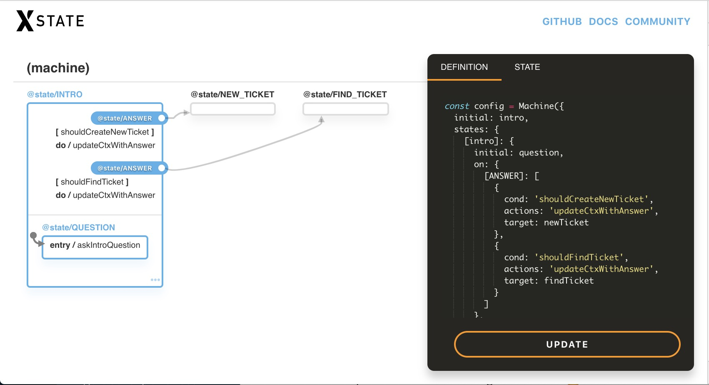

TOC

### Intro

xstate is a `statechart` library.
Statecharts are an extenstion of state machines that work better in real world applications.

### Two types of state

There are two types of state.

1. State of your app. These answer questions like:

- "is it loading?"
- "is there an error?"
- "are we waiting for user input?"
- "are we fetching user data?"

The answers here determine **which** view is used:

```jsx
{
  error && <Error />;
}
```

2. Stateful data, called `context` in `xState`. These answer questions like:

- "what is the error message?"
- "what are the results from the api request?"
- "which filter/option is currently selected?"

Answering these questions determines **what** properties a view has:

```jsx
<Error msg={context.errorMsg}>
```

### Machine?

- the term machine from state machine always felt a bit abstract to me.
  For our use case, it may be easier to see it as:

A function that does things based on input **AND** the current state of your app.

```js
const appState = "isLoading";
function machine(input) {
  if (appState === "isLoading") {
    // do loading things with `input`
  }
  if (appState === "isError") {
    // do errror things with `input`
  }
}
```

Here's a familiar state machine:

```js
// state is `idle`
fetch() // state is `fetching`
.then(
  (successResults) => {
    // state is 'success'
    // app state is 'successResults'
  }
  (errorMsg) => {
    // state is 'error' */
    // errorMsg is 'errorMsg' */
  }
);

// NOTE: state here is different than the data that is returned
```

The biggest thing to note here is that the `app state` can only be **one thing** at a time.

So, you don't run into this:

```js
 // NOPE, NOPE, NOPE
if (isLoading && !isError) // ...
if (!isLoading && isError) // ...
if (isLoading && isError) // ...
```

### Tell me which state we're in and I'll tell you what the UI looks like

UI should be a function of state.
This is different than UI being a function of the data we currently have.

This means that:

`State: list.noResults` => UI displays 'No results found.'
`State: list.isError` => UI displays 'There was an error loading your request'

#### vs.

`{ list: [] }` => "list is empty, so we probably don't have any results #YOLO"
`{ list {err: 'failed' }}` => "we have a string in `err` #YOLO"

This is an important distinction.
The conversation here shifts from:

> "What do we do if we have zero results ?"

To:

> "What does the UI look like **WHEN** we're in a `noResults` state?"

You're now building your UI to account for that state everywhere.
Does the title change? Do the icons change? Does something become disabled? Should there be a try again button?

### State Machine Configuration

It's cool to configure a state machine to a point where the vast majority of your UI logic can be understood from it.

```js
// guards.js - conditional functions used to determine what the next step in the flow is
const guards = {
  shouldCreateNewTicket: (ctx, { data }) => data.value === "new_ticket",
  shouldFindTicket: (ctx, { data }) => data.value === "find_ticket"
};

// actions.js - functions that perform an action like updating the stateful data in the app
const actions = {
  askIntroQuestion: ctx => {
    return {
      ...ctx,
      chat: ["How may I help you?"]
    };
  }
};

// constants/state.js constants to represent the current state of the app
const intro = "@state/INTRO";
const question = "@state/QUESTION";
const newTicket = "@state/NEW_TICKET";
const findTicket = "@state/FIND_TICKET";

// constants/actions.js: constants to represent actions to be taken
const ANSWER = "@state/ANSWER";

const config = Machine({
  initial: intro,
  states: {
    [intro]: {
      initial: question,
      on: {
        [ANSWER]: [
          {
            cond: "shouldCreateNewTicket",
            actions: "updateCtxWithAnswer",
            target: newTicket
          },
          {
            cond: "shouldFindTicket",
            actions: "updateCtxWithAnswer",
            target: findTicket
          }
        ]
      },
      states: {
        [question]: { onEntry: "askIntroQuestion" }
      }
    },
    [newTicket]: {},
    [findTicket]: {}
  }
}).withConfig({
  actions,
  guards
});
```

#### The snippet above reads as:

- initial state is `intro` from _states.intro_
  - the initial state inside of `intro` is _question_
  - `onEntry` of `intro.question` we'll trigger action `askIntroQuestion`
    - _nothing happens here... the UI is idle... now we wait_
    - on an `ANSWER` event:
      - if `shouldCreateNewTicket`
        - `updateCtxWithAnswer`
        - go to `newTicket` state
      - if `shouldFindTicket`
        - `updateCtxWithAnswer`
        - go to `findTicket` state

#### And can be visualized at https://statecharts.github.io/xstate-viz/



The great thing about this visualization is that it's built from the actual code.
These aren't code comments or a `spec-32.pdf` on the shared hard drive that hasn't been updated in 8 months.

This is legit.

This helps drive conversations about the product flow and can align stakeholders around what each state of the app is.

It becomes clear if there is an `error` state.  
Or if there should be a `noResults` vs. an `error` state

## Lets build a chat bot flow

looks like:
< IMAGE HERE>

> SPEC:
>
> As a user I want to be able to:
>
> 1.  create a new ticket to order something
> 2.  find an existing ticket
>
> [Create new ticket]
>
> - when ordering an item, if there aren't any more items in stock, offer the user a chance to order something else
>
> [Find ticket]
>
> - if found, ask the user if they would like to send a "ping" to that order

## FLOW

#### Intro

- show chat message `How may I help you today?`
- show options => `[Create new Ticket] [Inquire Existing Ticket]`

#### Create Ticket

- show chat message `what would you like to order?`
- show new ticket options => `[monitor] [laptop] [mouse]`
  - on Ticket option selection:
    - request item selected from api
      - if `Loading`
        - show loading chat mesage
      - on `Error`
        - show an error message
      - on `Success`
        - if we don't have that item in stock:
          - show a warning message
          - show item options with the out of stock item grayed out
          - user should be able to select from options again
        - if we have the item in stock:
          - show success message

#### Find Exisiting Ticket

- show chat message `Please enter ticket number`
- show select box with possible ticket numbers
  - on Ticket option selection:
    - request ticket selected from api
      - if `Loading`
        - show loading chat mesage
      - on `Error`
        - show an error message
      - on `Success`
        - if we have the ticket:
          - display what was ordered
        - if we don't have the ticket:
          - display warning message
          - show button to create new ticket

            - on create new ticket goto `[Create Ticket]` flow

### Render component per state

```jsx

// components/Choices.jsx
const Choices = ({ currentState, ...props}) => (
  // based on current state, get a function from `stateRenders`
  // and render it with the props we have
  const [stateName, renderState] =
      stateRenderers.find(([key]) => currentState.matches(key));

  return renderState(props);
)

/**
 * Array of
 * [].<StateName, function>
 *
 * NOTE: specificity matters here so a more specific state
 * should be first in the list. e.g:
 * 'findTicket.noResults'
 * 'findTicket'
 *
 * On state 'findTicket.foo', 'findTicket' will be matched
 */
const stateRenderers = [
  [newTicket, ({ onSelect, currentState }) =>
    <Choices
      options={currentState.context.options}
      onSelect={onSelect} />
  ],

  [`${findTicket}.${noResults}`, () =>
    <Msg>Sorry, we can't find your ticket</Msg>],

  [`${findTicket}.${error}`, () => <Mgs>Ooops, we ran into an error!</Msg>],

  [findTicket, ({ onSelect }) => <FindTicketForm onSelect={onSelect} />]
];
```
